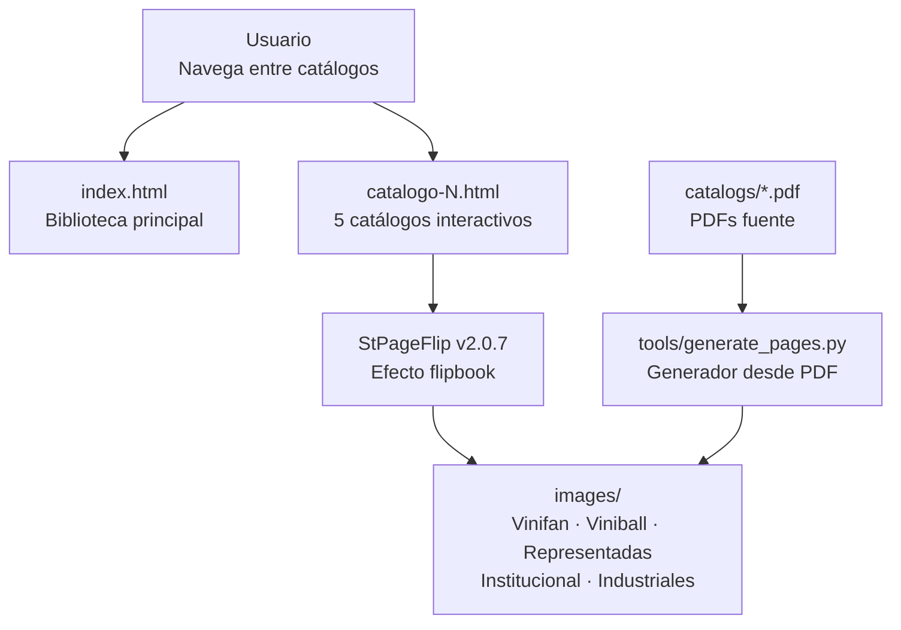

# g360-catalogos-CIPSA

<picture>
  <source media="(prefers-color-scheme: dark)" srcset="logotypes/logo-g360-light.svg">
  
</picture>

> Estante digital de catálogos CIPSA con efecto flipbook interactivo

[](https://github.com)
[](https://github.com/carloscus/g360-cli)
[](https://developer.mozilla.org/es/docs/Web/HTML)

## ¿Cómo está organizado el proyecto?



## Tabla de Contenidos

- [Descripción](#descripción)
- [Características](#características)
- [Catálogos](#catálogos)
- [Tecnologías](#tecnologías)
- [Instalación](#instalación)
- [Uso](#uso)
- [Estructura](#estructura)
- [Generación de Imágenes](#generación-de-imágenes-desde-pdf)
- [Deploy](#deploy)
- [Actualización Anual](#actualización-anual)
- [Analytics](#analytics)
- [Ecosistema G360](#ecosistema-g360)

---

## Descripción

**g360-catalogos-CIPSA** es un estante digital que presenta los catálogos de productos de CIPSA con un efecto flipbook interactivo. Los usuarios pueden navegar entre catálogos, hojear páginas con animación de volado, y acceder a información detallada de cada línea de productos.

**Tipo**: Web App estática (HTML/CSS/JS vanilla)  
**Uso**: Presentación de catálogos de productos CIPSA  
**Deploy**: GitHub Pages

---

## Características

- **Flipbook interactivo**: Efecto de página voladora con StPageFlip
- **Detección automática de orientación**: Se adapta a imágenes portrait o landscape
- **Miniaturas con progreso**: Panel emergente con bloques de páginas y barra de progreso
- **Salto directo a página**: Input numérico para escribir la página destino
- **Slider de navegación**: Barra arrastrable en la toolbar
- **Toolbar inferior**: Acceso rápido a navegación, lupa, miniaturas, pantalla completa y sonido
- **Pantalla completa**: Fullscreen API sin márgenes
- **Lupa de ampliación**: Ventana de inspección con zoom, pin y pan
- **Captura para pedido**: Botón `📷` descarga la región ampliada como PNG a 2x
- **Flip por arrastre**: Arrastrar la página para voltear
- **Zoom de página completa (móvil)**: Pinch (2 dedos) para acercar
- **Índice / secciones**: Panel `☰` con acceso directo a secciones
- **Compartir página**: Botón `🔗` copia URL con `?page=N`
- **Persistencia de lectura**: Recuerda última página leída por catálogo
- **Marca de agua**: Logo CIPSA con año reactivo
- **Precarga inteligente**: Prefetch de la página siguiente
- **Sonidos**: Efectos de audio configurables (flip, hover, jump)
- **Responsive**: Desktop, tablet y móvil (breakpoints: 1024px, 768px, 480px)
- **URLs compartibles**: Cada catálogo tiene URL directa con soporte de página específica
- **Fondos personalizados**: Cada catálogo tiene su paleta de colores y acentos
- **Identidad G360**: Branding consistente con `g360-signature`

---

## Catálogos

| # | Catálogo | Categoría | Páginas | Descripción |
|---|----------|-----------|---------|-------------|
| 1 | **VINIFAN** | Principal - Escolares | 72 | Vinilos y productos escolares de alto rendimiento |
| 2 | **VINIBALL** | Principal - Pelotas | 76 | Pelotas y sistemas de contención deportiva |
| 3 | **REPRESENTADAS** | Oficina y Tools | 32 | Marcas representadas de oficina y herramientas |
| 4 | **INSTITUCIONAL** | Personalizados | 15 | Productos personalizados e institucionales |
| 5 | **INDUSTRIALES** | Empresas | 10 | Soluciones industriales para empresas |

---

## Tecnologías

- **Core**: HTML5, CSS3, JavaScript (Vanilla)
- **Flipbook**: [StPageFlip](https://github.com/nicholasgasior/page-flip) v2.0.7
- **Estilos**: CSS Custom Properties, Glassmorphism
- **Audio**: Web Audio API (sonidos generados programáticamente)
- **Sin framework**: Máxima compatibilidad, cero dependencias de runtime

---

## Instalación

### Requisitos

- Cualquier servidor HTTP estático
- Python >= 3.x, Node.js >= 18, o equivalente

### Pasos

```bash
git clone https://github.com/carloscus/g360-catalogos-cipsa.git
cd g360-catalogos-cipsa
# No necesita instalación de dependencias
```

---

## Uso

### Inicio Rápido

```bash
# Con Python
python -m http.server 5174

# Con Node.js
npx serve .
```

### Estructura de URLs

| Página | URL |
|--------|-----|
| Biblioteca | `index.html` |
| VINIFAN | `catalogo-1.html` |
| VINIBALL | `catalogo-2.html` |
| REPRESENTADAS | `catalogo-3.html` |
| INSTITUCIONAL | `catalogo-4.html` |
| INDUSTRIALES | `catalogo-5.html` |
| Página específica | `catalogo-1.html?page=15` |

---

## Estructura

```
g360-catalogos-CIPSA/
├── index.html                  # Biblioteca principal
├── catalogo-1.html             # VINIFAN
├── catalogo-2.html             # VINIBALL
├── catalogo-3.html             # REPRESENTADAS
├── catalogo-4.html             # INSTITUCIONAL
├── catalogo-5.html             # INDUSTRIALES
├── css/
│   ├── styles.css              # Estilos globales G360/CIPSA
│   └── flipbook.css            # Estilos del visor flipbook
├── js/
│   ├── config.js               # Configuración de catálogos y flipbook
│   ├── audio.js                # Sistema de sonidos Web Audio
│   ├── year.js                 # Título/hero/footer reactivos al año
│   ├── analytics.js            # Capa de eventos (GA4/GoatCounter-ready)
│   └── flipbook-ui.js          # Lógica compartida: nav, zoom, miniaturas
├── images/
│   ├── vinifan/                # Páginas del catálogo VINIFAN
│   ├── viniball/               # Páginas del catálogo VINIBALL
│   ├── representadas/          # Páginas del catálogo REPRESENTADAS
│   ├── institucional/          # Páginas del catálogo INSTITUCIONAL
│   └── industriales/           # Páginas del catálogo INDUSTRIALES
├── assets/brand/               # Logos y favicons CIPSA
├── catalogs/                   # PDFs fuente (NO versionados)
└── tools/
    ├── generate_pages.py       # Generador desde PDF
    └── generate_pages.bat      # Run manual en Windows
```

---

## Generación de Imágenes desde PDF

Las páginas del flipbook se generan desde los PDFs de `catalogs/` (que NO se suben al repo) usando un script local. Renderiza cada página a alta resolución para que el zoom 2x y pantallas retina se vean nítidos.

### Formato

Se usa **WebP q80** (lossy, `method=4`), que reduce el peso ~50% vs JPEG con calidad comparable. Compatible con todos los navegadores modernos.

### Requisitos

```bash
pip install pymupdf pillow
```

### Uso manual

```bat
# Generar/actualizar todos los catálogos
tools\generate_pages.bat

# Solo un tema
tools\generate_pages.bat vinifan

# Con Python directo
python tools\generate_pages.py --only vinifan --dry-run
```

### Especificaciones de salida

| Orientación | Ancho objetivo | Tamaño estimado/pág |
|-------------|---------------|---------------------|
| Portrait | 2000px | ~200-300KB |
| Landscape | 2600px | ~180-330KB |

- `cover.webp` se genera automáticamente desde la página 1
- **`detail/`**: versión a 2800px por página para la lupa (zoom profundo nítido)
- Los PDFs permanecen excluidos del repo (`.gitignore` → `catalogs/*.pdf`)

---

## Deploy

### GitHub Pages

1. Crear repositorio en GitHub
2. Push del código a `main`
3. Settings > Pages > Source: Deploy from branch
4. Branch: `main`, folder: `/ (root)`
5. Acceder a `https://carloscus.github.io/g360-catalogos-cipsa/`

---

## Actualización Anual

1. Reemplazar las imágenes en `images/{tema}/page_*.webp` manteniendo los nombres
2. Actualizar `total_pages` en `js/config.js` si cambia la cantidad de páginas
3. Actualizar las portadas en `images/{tema}/cover.webp`
4. Commit y push

---

## Analytics

El proyecto incluye una **capa de eventos** en `js/analytics.js` lista para conectar:

### Eventos registrados

| Evento | Cuándo |
|--------|--------|
| `view` | Al abrir un catálogo |
| `page_view` | Cada cambio de página |
| `next` / `prev` | Navegación por botones |
| `share` | Al compartir una página |
| `index_jump` | Salto por índice |

**Por defecto no envía datos a terceros** (solo consola si activas `?analytics=1`).

Para activarlo:
1. En `js/analytics.js` edita `DEFAULT_SERVICE` y completa el ID
2. O activa por URL: `catalogo-1.html?analytics=1`

---

## Ecosistema G360

Este proyecto forma parte del ecosistema **G360** para apoyo CRM y gestión de datos en CIPSA.

### Herramientas Relacionadas

- **[g360-cli](https://github.com/carloscus/g360-cli)** — CLI para automatización de tareas
- **[g360-order-xlsx](https://github.com/carloscus/g360-order-xlsx)** — Gestión de pedidos
- **[g360-signature](https://github.com/carloscus/g360-signature)** — Generador de firmas
- **[g360-signature-creator](https://github.com/carloscus/g360-signature-creator)** — Generador de firmas con interfaz web
- **[g360-day-calculator](https://github.com/carloscus/g360-day-calculator)** — Calculadora de días laborables

---

## Licencia

MIT License — ver [LICENSE](LICENSE) para más detalles.

---

**Marca**: G360 · Isotipo: 3 puntos verticales (gris-verde-gris) + chevron `>`  
**Signature**: G360 by ccusi · **Powered by**: [g360-signature](https://github.com/carloscus/g360-signature)
